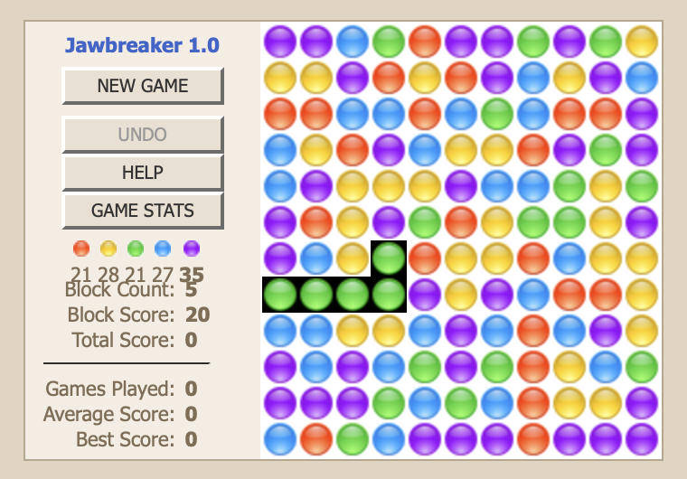

# Jawbreaker 

I wrote Jawbreaker back in 2005.  The web hosting service went out of business somewhere along the way
(was it Textdrive??) and I lost the code.  However, some gaming website had copied it, and are still hosting. 
The Javascript still works, ancient as it is.  The backend has been lost-in-time, probably was PHP with 
MySQL as the datastore.  

Remember adding some advertising to the page and making $75-$300 per month for close to a year.  
Unfortunately, Google changed advertising algorithms and making significantly less thereafter.
The Javascript is ancient, using the `prototype.js` library (don't remember that), that provides a 
**Ajax** library.

If I were to rewrite this, I'd remove the reliance on Prototype.js, write a new backend (to keep track
of scores), and replace the GIFs with Emojis.  For example, the red gif 
 could be replaced with the
red emoji: 🔴. 

Steve Spencer  
August, 2024

🟣🔵🟢🔴🟡

