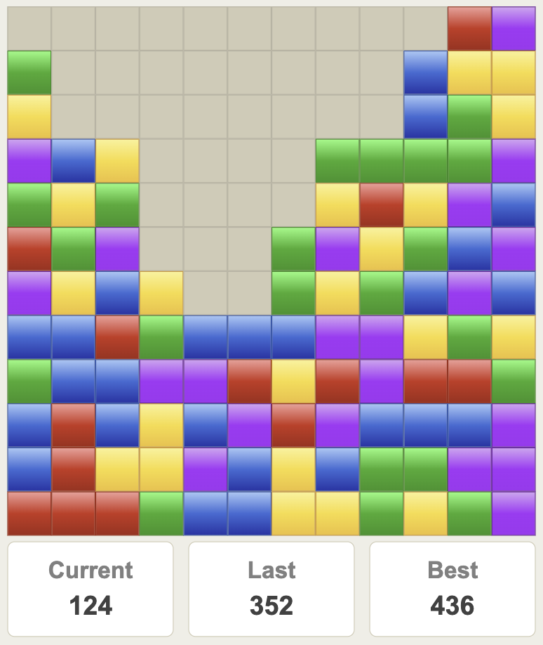

# Jawbreaker 

## Jawbreaker 2025

Recently (circa April 2025), [Datastar](https://data-star.dev/) has caught my attention. Reimplemented 
this new version (basically same html/css) with the game logic residing in a Go 
server.  The Javscript interaction comes from triggering the Datastar library with 
`data-*` tags. 

After writing the initial Datastar version, decided to write a new Javascript version so that animation and power-ups could be added.  Discovered the Datastar version is just as capable serving up power-ups and animation, so that has been updated too.

### Starting Jawbreaker

To run Jawbreaker, [Go SDK](https://go.dev/) is required.  Running the server is
as simple as downloading Go and issuing the following command:

    $ go run ./cmd/web

Play on any browser by following the following links (depending on tech used for game)
1. Javascript: [http://localhost:8000/](http://localhost:8000/)
2. Javascript for development: [http://localhost:8000/dev](http://localhost:8000/dev) -- Javascript is served inline in the HTML file to make development easier without worrying about browser cache
3. Datastar ("no" JS): [http://localhost:8000/datastar](http://localhost:8000/datastar) -- game logic is written in Go and the entire game board (256 divs) is served for every "animation" or action via SSE using [Datastar](https://data-star.dev/)

## Jawbreaker 2024

Rewrote Javascript with modern javascript.  No external dependencies required, first or 
third party.  No images used, just CSS.  Single file.  The code for this edition lives in 
the [jawbreaker-2024](https://github.com/sspencer/jawbreaker-2024) repo.
Game looks same as screenshot above.

## Jawbreaker 2005

I wrote Jawbreaker back in 2005.  The web hosting service went out of business somewhere 
along the way (was it Textdrive??) and I lost the code.  However, some gaming website had 
copied it, and are still hosting. The Javascript still works, ancient as it is.  The backend 
has been lost-in-time, probably was PHP with MySQL as the datastore.

Remember adding some advertising to the page and making $75-$300 per month for close to a year.
Unfortunately, Google changed advertising algorithms and making significantly less thereafter.
The Javascript is ancient, using the `prototype.js` library (don't remember that), that provides a
**Ajax** library.  The code for this version is archived in the 
[jawbreaker-2005](https://github.com/sspencer/jawbreaker-2005) repo.

If I were to rewrite this, I'd remove the reliance on Prototype.js, write a new backend (to keep track
of scores), and replace the GIFs with Emojis.  For example, the red gif
 could be replaced with the
red emoji: 🔴(or stylized CSS).  

